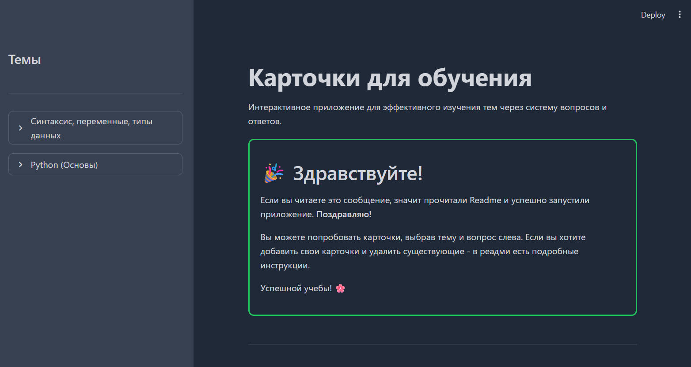
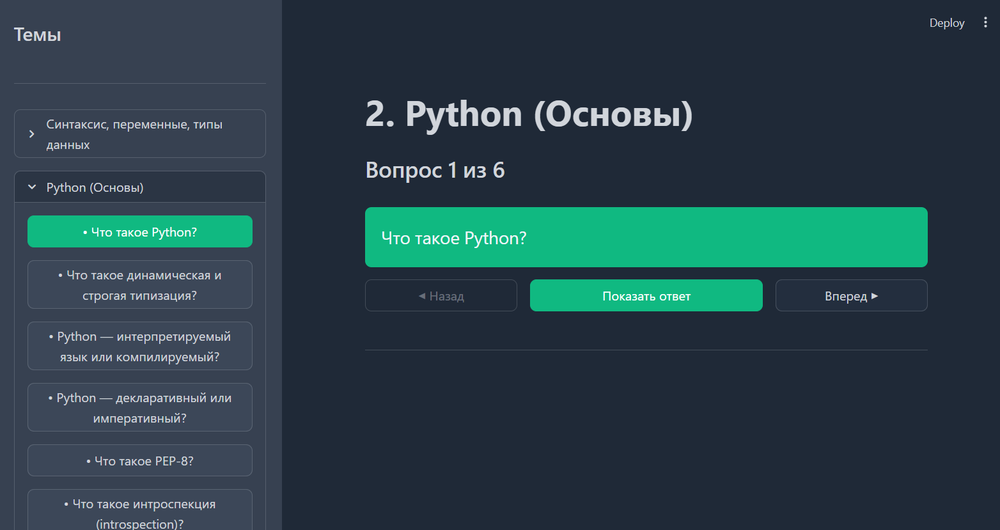
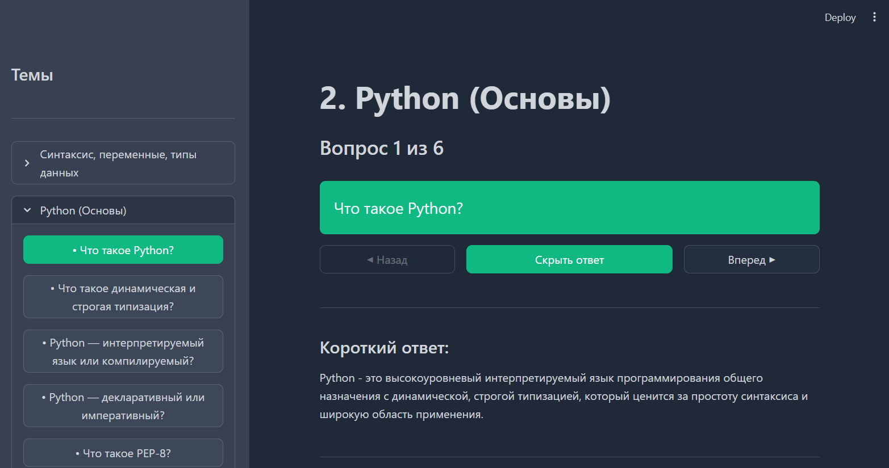
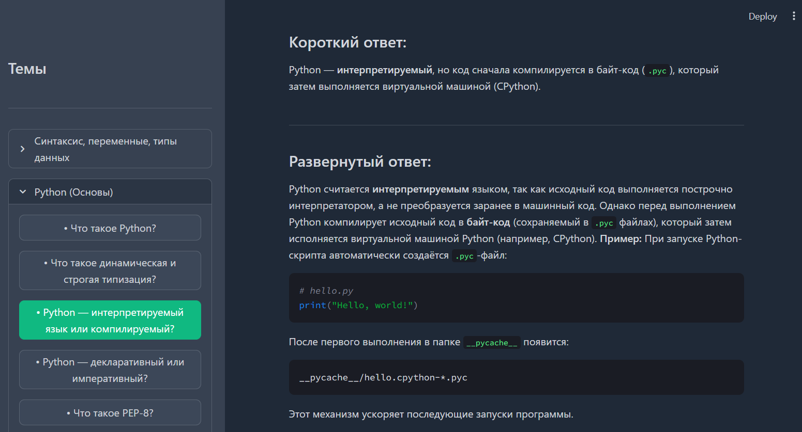

# Карточки для обучения (Flashcard App)

Интерактивное приложение для изучения тем через систему карточек с вопросами и ответами, построенное на Streamlit.


## Возможности

- **Организация по темам** — каждая тема в отдельном `.md` файле
- **Структурированные вопросы** — вопрос → короткий ответ → развернутый ответ
- **Интерактивное обучение** — возможность скрывать/показывать ответы
- **Удобная навигация** — переход между вопросами, быстрый доступ
- **Адаптивный интерфейс** — боковая панель с аккордеонами тем

## Скриншоты

|  |  |  | |

## Установка и запуск

### 1. Клонирование репозитория


### 2. Установка виртуального окружения и зависимостей
```bash
python -m venv venv
source venv/bin/activate
```

```bash
pip install -r requirements.txt
```

**requirements.txt:**
```txt
streamlit>=1.28.0
```

### 3. Запуск приложения
```bash
streamlit run app.py
```

Приложение будет доступно по адресу: `http://localhost:8501`

## Формат файлов с вопросами

Каждая тема — это `.md` файл в папке `cards/` со следующей структурой:

```markdown
# Название темы

### Вопрос 1?
#### Короткий ответ
Краткий ответ (1-5 предложения)

#### Развернутый ответ
Подробное объяснение с примерами, кодом, списками.

### Вопрос 2?
#### Короткий ответ
Ещё один краткий ответ.

#### Развернутый ответ
Детальное описание с Markdown разметкой.
```

**Правила:**
- Вопросы начинаются с `### `
- Короткий ответ — с `#### Короткий ответ`
- Развернутый ответ — с `#### Развернутый ответ`
- Поддерживается Markdown разметка (жирный, курсив, списки, код)

## Интерфейс приложения

### Левая панель (сайдбар)
- Список тем в формате аккордеонов
- Каждая тема раскрывается в список вопросов
- Текущий вопрос выделен цветом

### Основная область
- Динамический заголовок с названием темы и прогрессом
- Карточка с текущим вопросом
- Кнопки "Показать/Скрыть ответ"
- Навигация между вопросами
- Отображение ответов (короткий + развернутый)

## Пример использования
1. **Добавьте свои темы** — создайте `.md` файлы в папке `cards/`
2. **Запустите приложение** — `streamlit run app.py`
3. **Выберите тему** — в левой панели
4. **Изучайте вопросы** — по одному, с самопроверкой
5. **Повторяйте** — скрывайте ответы для закрепления

## Как добавить новую тему

1. Создайте новый файл в папке `cards/`, например `3.новая_тема.md`
   Рекомендую в начале файла добавить нумерацию, как в примерах, чтобы темы были упорядочены.
2. Используйте правильный формат (см. выше)
3. Добавьте вопросы с ответами
4. Перезапустите приложение (автоматически подхватит новый файл)

## Отладка и проблемы

### Если вопросы не отображаются:
1. Проверьте формат файла — вопросы должны начинаться с `### `
2. Убедитесь в кодировке UTF-8
3. Проверьте структуру ответов (короткий/развернутый)

### Если приложение не запускается:
1. Установите зависимости: `pip install streamlit`
2. Проверьте версию Python (>=3.8)
3. Убедитесь, что файлы в папке `cards/` имеют расширение `.md`
